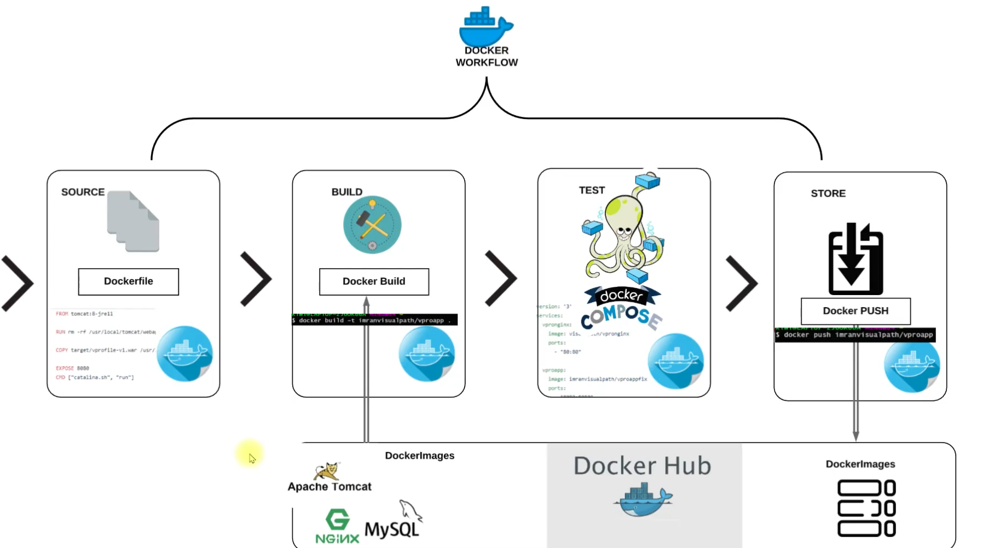

# Containerization of an Application: A Complete Journey

## Overview

This project demonstrates the complete process of containerizing a multi-tier Java application using Docker. I documented my journey from traditional VM-based deployment to a fully containerized solution, showcasing best practices in containerization, orchestration, and deployment.

## Project Motivation

### Initial Challenge
I started with a traditional multi-tier application stack running on virtual machines, facing several challenges:
- High capital and operational expenses
- Manual deployment processes prone to human errors
- Limited scalability and microservice compatibility
- Resource wastage and environment synchronization issues
- Lack of portability across different environments

### Solution Approach
I turned to containerization using Docker, which provided:
- **Resource Efficiency**: Containers consume fewer resources than VMs
- **Microservice Compatibility**: Perfect fit for modern application architectures
- **Consistency**: Same images across all environments
- **Portability**: Easy deployment across different platforms
- **Automation**: Streamlined deployment processes

## Technology Stack

### Core Technologies
- **Docker**: Container runtime and orchestration
- **Docker Compose**: Multi-container application orchestration
- **Vagrant**: Virtual machine provisioning
- **Oracle VM VirtualBox**: Virtualization platform

### Application Stack
- **Nginx**: Web server and reverse proxy
- **Tomcat**: Java application server
- **MySQL**: Relational database
- **Memcached**: Distributed caching system
- **RabbitMQ**: Message broker
- **Elasticsearch**: Search and analytics engine

## Architecture



The architecture follows a microservices pattern with:
- **Load Balancer**: Nginx handles incoming traffic
- **Application Layer**: Java application running on Tomcat
- **Data Layer**: MySQL for persistent storage
- **Caching Layer**: Memcached for performance optimization
- **Messaging Layer**: RabbitMQ for asynchronous communication
- **Search Layer**: Elasticsearch for indexing and search capabilities

## Development Environment Setup

### Prerequisites
- Oracle VM VirtualBox
- Vagrant with hostmanager plugin
- Git Bash or equivalent terminal
- Docker Engine

### Environment Configuration
```sh
cd
mkdir /f/docker-engine
cd /f/docker-engine/
vagrant init bento/ubuntu-22.04
```

### Network Configuration
I explored various Vagrant network configurations:
- **Forwarded Ports**: For external access to services
- **Private Networks**: For isolated host-VM communication
- **Public Networks**: For bridged network access

## Docker Implementation

### Multi-Stage Build Strategy
I implemented a multi-stage Dockerfile for the application to optimize image size and build efficiency:

#### Stage 1: Build Environment
```dockerfile
FROM openjdk:11 AS BUILD_IMAGE
RUN apt update && apt install maven -y
RUN git clone https://github.com/devopshydclub/vprofile-project.git
RUN cd vprofile-project && git checkout docker && mvn install
```

#### Stage 2: Runtime Environment
```dockerfile
FROM tomcat:9-jre11
RUN rm -rf /usr/local/tomcat/webapps/*
COPY --from=BUILD_IMAGE vprofile-project/target/vprofile-v2.war /usr/local/tomcat/webapps/ROOT.war
EXPOSE 8080
CMD ["catalina.sh", "run"]
```

### Service Containerization
Each service was containerized with appropriate base images:
- **Database**: MySQL 8.0.33-debian with automatic initialization
- **Web Server**: Nginx Alpine for lightweight reverse proxy
- **Application**: Custom Tomcat image with multi-stage build
- **Caching**: Official Memcached Alpine image
- **Messaging**: RabbitMQ with management interface
- **Search**: Elasticsearch 5.6.4 with proper configuration

### Docker Compose Orchestration
```yaml
version: '3.8'

services:
  vprodb:
    build: ./Docker-files/db
    container_name: vprodb
    restart: unless-stopped
    ports:
      - "3306:3306"
    volumes:
      - db_data:/var/lib/mysql
    networks:
      - vprofile-network

  vprocache01:
    image: memcached:alpine
    container_name: vprocache01
    restart: unless-stopped
    ports:
      - "11211:11211"
    networks:
      - vprofile-network

  vpromq01:
    image: rabbitmq:3-management
    container_name: vpromq01
    restart: unless-stopped
    ports:
      - "5672:5672"
      - "15672:15672"
    networks:
      - vprofile-network

  vprosearch01:
    image: elasticsearch:5.6.4
    container_name: vprosearch01
    restart: unless-stopped
    ports:
      - "9200:9200"
      - "9300:9300"
    networks:
      - vprofile-network

  vproapp:
    build: ./Docker-files/app
    container_name: vproapp
    restart: unless-stopped
    depends_on:
      - vprodb
      - vprocache01
      - vpromq01
      - vprosearch01
    ports:
      - "8080:8080"
    networks:
      - vprofile-network

  vproweb:
    build: ./Docker-files/web
    container_name: vproweb
    restart: unless-stopped
    depends_on:
      - vproapp
    ports:
      - "80:80"
    networks:
      - vprofile-network

volumes:
  db_data:

networks:
  vprofile-network:
    driver: bridge
```

## Deployment Process

### 1. Image Building
```sh
docker compose build
```

### 2. Container Verification
```sh
docker images
```

### 3. Application Deployment
```sh
docker compose up -d
```

### 4. Image Distribution
```sh
docker push vprocontainers/vprofileapp:latest
docker push vprocontainers/vprofiledb:latest
docker push vprocontainers/vprofileweb:latest
```

## Key Learnings

### Docker Best Practices
- **Multi-stage builds** for optimized image sizes
- **Official base images** for security and maintenance
- **Proper layer caching** for faster builds
- **Environment variable usage** for configuration flexibility

### Orchestration Benefits
- **Service dependencies** ensure proper startup order
- **Network isolation** for secure inter-service communication
- **Volume persistence** for data durability
- **Health checks** for service monitoring

### Security Considerations
- **Non-root users** in containers
- **Minimal base images** to reduce attack surface
- **Secret management** for sensitive configuration
- **Network segmentation** for service isolation

## Industry Context

Containerization adoption statistics show:
- 50% of organizations have containerized applications
- 29% run containers in production
- 78% use AWS platform for containerized workloads
- 81% managed by DevOps teams

## Conclusion

This project successfully demonstrates the transformation from traditional VM-based deployment to a modern, containerized architecture. The journey showcases:

- **Technical Skills**: Docker, Docker Compose, multi-stage builds
- **Best Practices**: Security, optimization, and maintainability
- **Industry Alignment**: Following current DevOps and containerization trends
- **Practical Application**: Real-world deployment and distribution

The containerized solution provides better resource utilization, improved deployment consistency, and enhanced scalability compared to the original VM-based approach.

